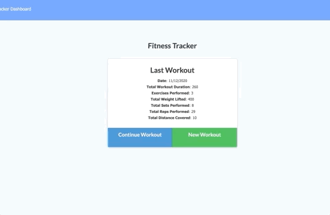
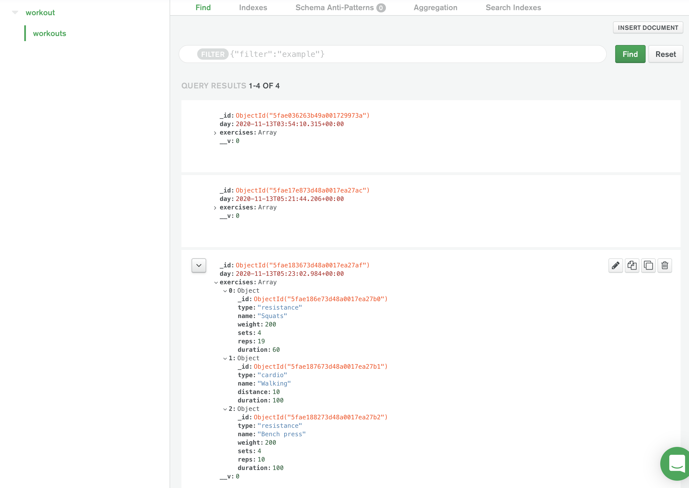

# work-it-out

This app was made for the health conscious user who wants to keep track of their workouts. 
Work it out will track your workout duration, how many reps and sets, as well as how much weight you were using. It keeps track of that data and puts it into a graph/chart form on your stats page. It's ease of use will make it a staple in any gym rats life. Here is a [link to the deployed heroku site](https://enigmatic-spire-09187.herokuapp.com/stats)

